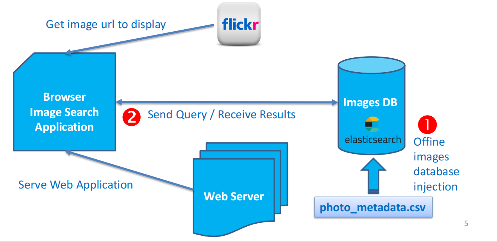

# ELK-Search-Project
## Overview
Welcome to the  ELK-Stack-SearchEngine project! This application provides a powerful and intuitive way to search through extensive text datasets using Elasticsearch. When you perform a textual search, it retrieves and displays images from Flickr that match your query, leveraging both the Flickr website and the provided dataset. The search results are showcased through a user-friendly web interface built with Streamlit. To ensure easy access and sharing, ngrok is used to make the application available to a wider audience.

## Key Features

### Elasticsearch Integration
- **Efficient Search**: Utilize the powerful Elasticsearch search engine to index and search through extensive textual data. This ensures fast and accurate search results.

### Streamlit Web Interface
- **User-Friendly Interface**: Build an intuitive and interactive web interface with Streamlit. Users can easily perform searches, view results, and explore the data.

### Logstash Data Ingestion
- **Seamless Data Processing**: Use Logstash to ingest CSV data into Elasticsearch. This integration handles the collection, parsing, and indexing of data, facilitating smooth and efficient data ingestion.

## Application Architecture

